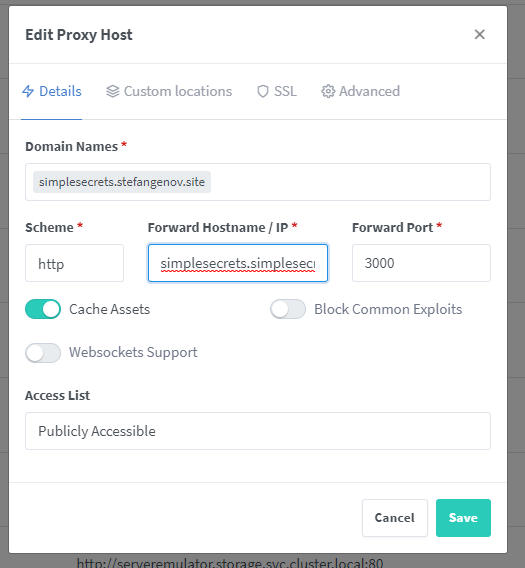
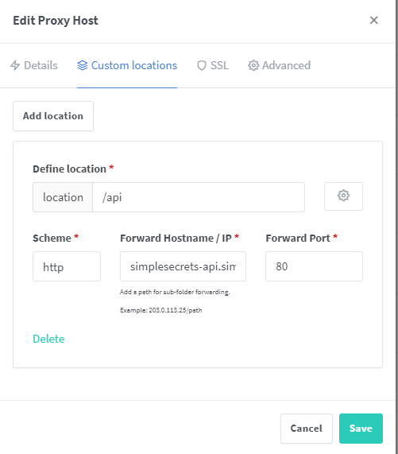

This chart is used to deploy SimpleSecrets and all needed CRDs.

After starting, go to {{ K8S_URL }}:30000 and set the `Currently using:` to {{ K8S_URL }}:30001

Alternatively you can set it up behind a reverse proxy and you don't need to expose any service.

Examples with Nginx Proxy Manager:

